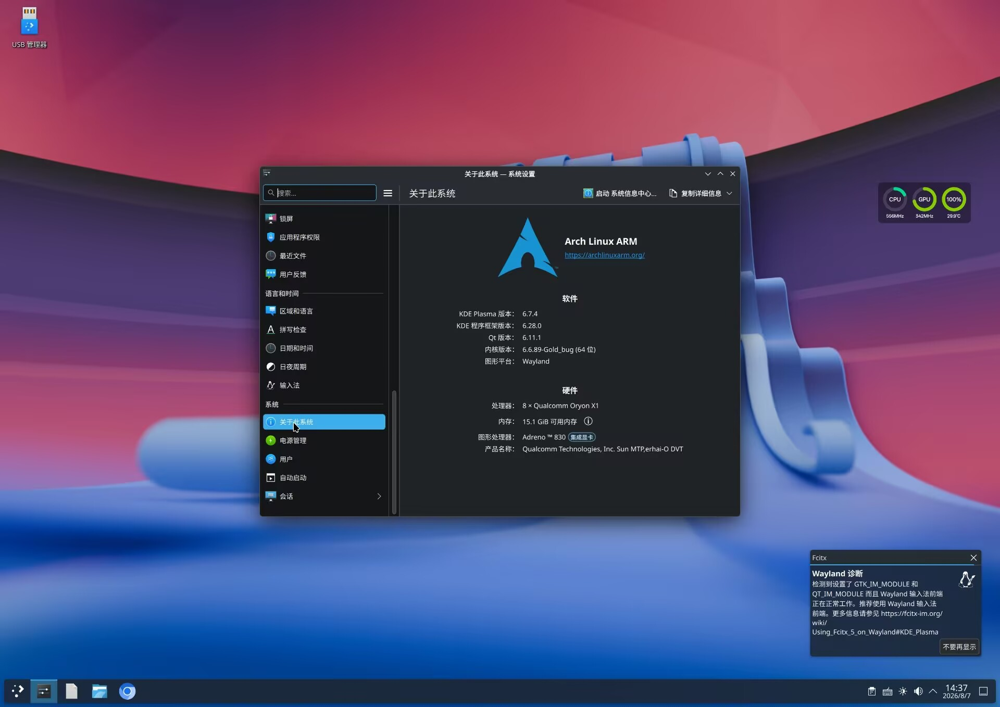
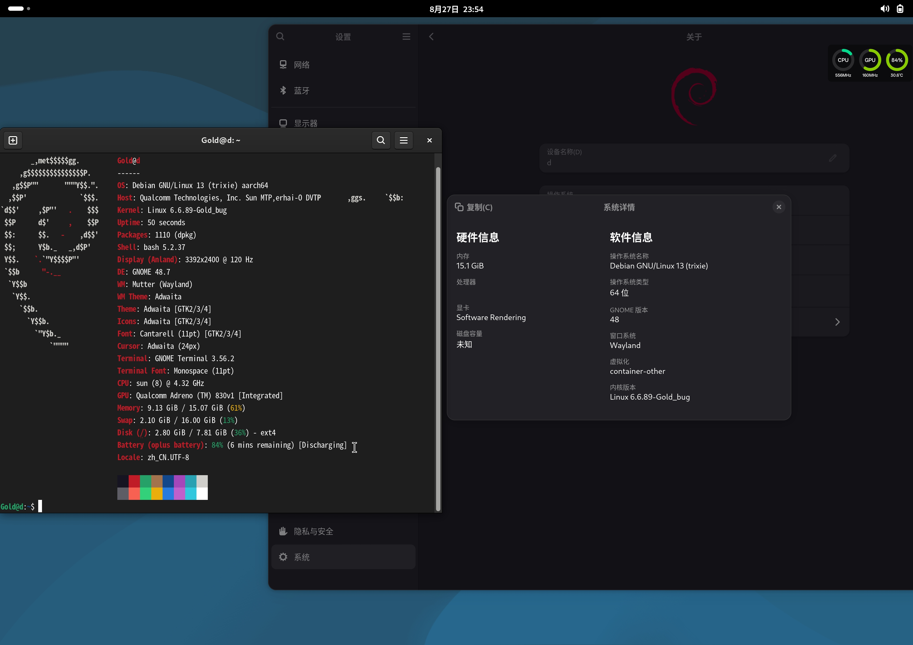
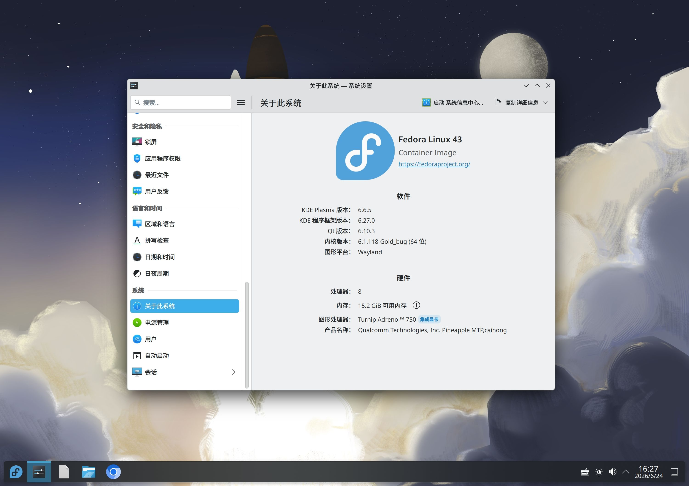
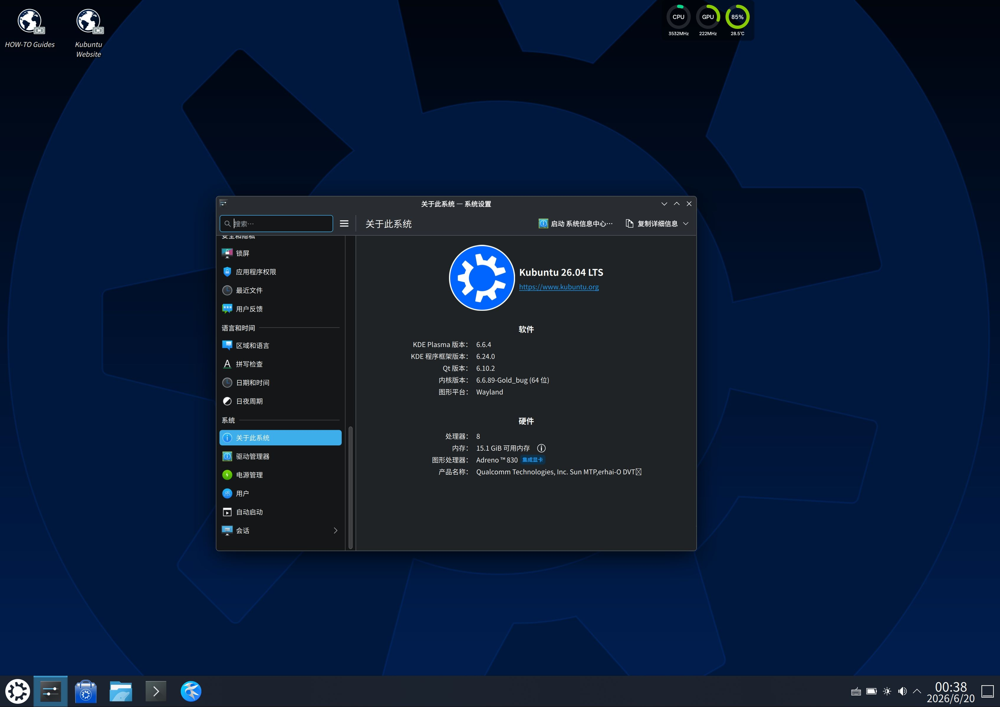
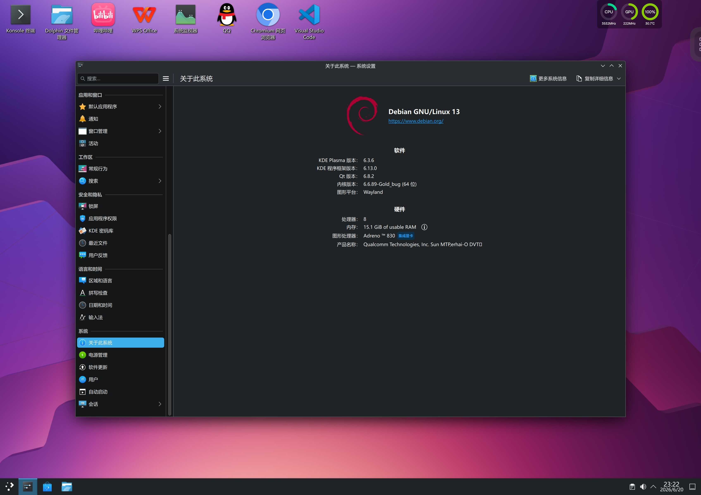

[English documentation](../en/README.md) · [返回项目主页](../../README.md)

# 文档

按需选择教程：

- [快速开始：构建、下载并导入 RootFS](快速开始.md)
- [构建选项与发行版兼容性](构建选项.md)
- [桌面启动与 Anland Wayland 配置](桌面与Anland.md)
- [TUI、USB、固件与本地构建](进阶使用.md)
- [脚本维护说明](../../scripts/README.md)

## 桌面截图

以下图片来自不同发行版和设备配置。软件版本、主题与性能表现会因构建时间、设备和 Droidspaces 设置而异。

### Arch Linux ARM · KDE Plasma · Wayland

### Debian 13 · GNOME · Wayland

### Fedora 43 · KDE Plasma · Wayland

### Kubuntu 26.04 · KDE Plasma · Wayland

### Debian 13 · KDE Plasma · Wayland

